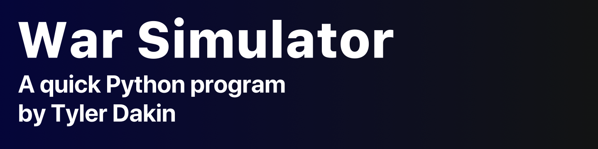

### Overview
War Simulator is designed to simulate the card game, War, but on a much larger scale. A user can decide to run several games with several players and get the outcomes printed back to them. 

### Dependencies
This program uses packages **sys** and **random** but both should be included with your installation of Python. If I recall correctly, I did not need to use pip to install them.

### Known Issues
- Crash occurs when more than 10 players are used.

---
##### As of writing this I do not have plans to do a full write-up on this program.

